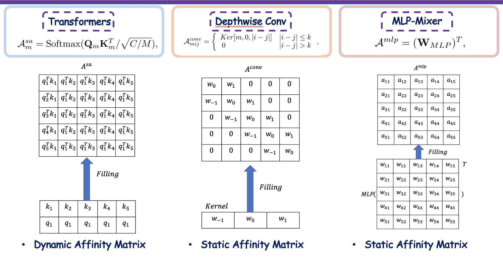
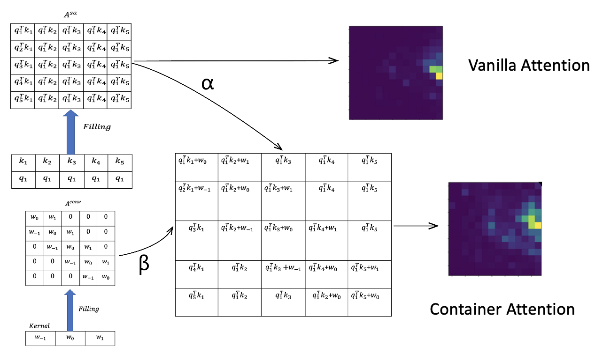

# Container: Context Aggregation Network

Official Code Release for Container : Context Aggregation Network

# Comparion between CNN, MLP-Mixer and Transformer

# Container combine best of both worlds


Code release:

1. Imagenet pretrained model for Container V1 : [Container V1](https://github.com/allenai/container)
2. Imagenet pretrained model for Container V2 : [Container V2](https://github.com/gaopengcuhk/Contianer-V2)


## Citation
If you find this repository useful, please consider citing our work:
```
@article{gao2021container,
  title={Container: Context Aggregation Network},
  author={Gao, Peng and Lu, Jiasen and Li, Hongsheng and Mottaghi, Roozbeh and Kembhavi, Aniruddha},
  journal={arXiv preprint arXiv:2106.01401},
  year={2021}
}
```

## News
Container got accepted by [Neuips 2021](https://nips.cc/Conferences/2021).

## Contributor
Peng Gao

## Acknowledgement
The codebase are borrowed heavyily from DeiT.

