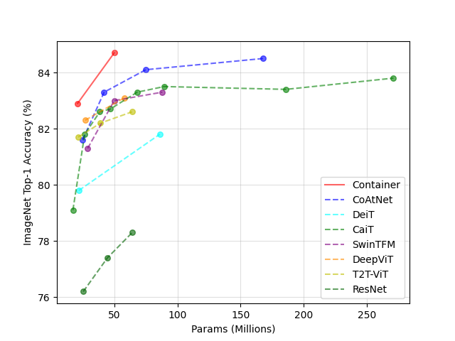

# Container: Context Aggregation Network

We offer two types of model, namely old model and new model. Old models are used for replicating our first version of our arxiv submission(fully test on downstream transfer like Mask RCNN, Retinanet, DETR, Semantic Segmentation, and DINO). New models add some tricks motivated by other paper and significantly improve upon old models (mainly validate on ImageNet classfication, not on downstream tasks) in our arxiv submission. 

Official Code Release for Container : Context Aggregation Network

Comparison with popular backbone :




Code Release Step:

Hierachical Multi-head Low-Rank MLP-Mixer (Old)

Container-Light pretraining on ImageNet (Old)：

1. Pre-trained Container-Light model 20 Millon Parameter (Old， 82.0% top1, 20M)


Container-Light on Single-Scale SMCA-DETR (Old)

Container-Light on RetinaNet and Mask-RCNN (Old)

Container-Light for Semantic Segmenetaion on ADE and Cityscape (Old)

Container-Light pretraining on ImageNet (New)：

1. Pre-trained Container-S model 20 Millon Parameter (New, 83.0% top1, 20M)

2. Pre-trained Container-M model 50 Millon Parameter (New, 84.5% top1, 50M)

Code release:

1 Imagenet pretrained model for Container V1 : [Container V1](https://github.com/allenai/container)


## Citation
If you find this repository useful, please consider citing our work:
```
@article{gao2021container,
  title={Container: Context Aggregation Network},
  author={Gao, Peng and Lu, Jiasen and Li, Hongsheng and Mottaghi, Roozbeh and Kembhavi, Aniruddha},
  journal={arXiv preprint arXiv:2106.01401},
  year={2021}
}
```

## Contributor
Peng Gao

## Acknowledgement
The codebase are borrowed heavyily from DeiT.

